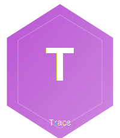

<p align="center">
  
</p>

# CrucibleTrace

**Structured causal reasoning chain logging for LLM code generation**

CausalTrace enables transparency and debugging in LLM-based code generation by capturing the decision-making process. It logs causal reasoning chains with events, alternatives considered, confidence levels, and supporting rationale.

## Features

- **Event Tracking**: Capture decision points with alternatives and reasoning
- **Chain Management**: Organize events into coherent reasoning chains
- **LLM Integration**: Parse events directly from LLM output with XML tags
- **Persistent Storage**: Save chains to disk in JSON format with search capabilities
- **Interactive Visualization**: Generate beautiful HTML views with filtering and statistics
- **Analysis Tools**: Query events, calculate statistics, find decision points
- **Multiple Export Formats**: JSON, Markdown, and CSV exports

## Installation

Add `causal_trace` to your list of dependencies in `mix.exs`:

```elixir
def deps do
  [
    {:crucible_trace, "~> 0.1.0"}
  ]
end
```

Or install from GitHub:

```elixir
def deps do
  [
  ]
end
```

## Quick Start

### Creating Events Manually

```elixir
# Create a new chain
chain = CrucibleTrace.new_chain("API Implementation")

# Create an event
event = CrucibleTrace.create_event(
  :hypothesis_formed,
  "Use Phoenix framework",
  "Well-established with great documentation and active community",
  alternatives: ["Plug alone", "Custom HTTP server"],
  confidence: 0.9
)

# Add event to chain
chain = CrucibleTrace.add_event(chain, event)

# View statistics
stats = CrucibleTrace.statistics(chain)
# => %{total_events: 1, avg_confidence: 0.9, ...}
```

### Parsing LLM Output

```elixir
llm_output = """
<event type="hypothesis_formed">
  <decision>Use GenServer for state management</decision>
  <alternatives>Agent, ETS table, Database</alternatives>
  <reasoning>GenServer provides good balance of simplicity and features</reasoning>
  <confidence>0.85</confidence>
  <code_section>StateManager</code_section>
</event>

<code>
defmodule StateManager do
  use GenServer
  # ... implementation
end
</code>
"""

# Parse into a chain
{:ok, chain} = CrucibleTrace.parse_llm_output(llm_output, "State Manager Implementation")

# Extract just the code
code = CrucibleTrace.extract_code(llm_output)
```

### Building Prompts for LLMs

```elixir
base_spec = """
Implement a caching layer for database queries with:
- TTL support for cache entries
- Cache invalidation on writes
- Thread-safe operations
"""

# Generate a prompt that instructs the LLM to emit causal trace events
prompt = CrucibleTrace.build_causal_prompt(base_spec)

# Send prompt to your LLM, it will include event tags in its response
```

### Visualization

```elixir
# Generate interactive HTML visualization
html = CrucibleTrace.visualize(chain, style: :light)

# Save to file
{:ok, path} = CrucibleTrace.save_visualization(chain, "trace.html")

# Or open directly in browser
{:ok, _path} = CrucibleTrace.open_visualization(chain)
```

### Storage and Retrieval

```elixir
# Save chain to disk
{:ok, path} = CrucibleTrace.save(chain)

# Load by ID
{:ok, loaded_chain} = CrucibleTrace.load(chain.id)

# List all chains
{:ok, chains} = CrucibleTrace.list_chains()

# Search with criteria
{:ok, results} = CrucibleTrace.search(
  name_contains: "API",
  min_events: 5,
  created_after: ~U[2024-01-01 00:00:00Z]
)

# Export to different formats
{:ok, markdown} = CrucibleTrace.export(chain, :markdown)
{:ok, csv} = CrucibleTrace.export(chain, :csv)
```

### Analysis

```elixir
# Find decision points with alternatives
decisions = CrucibleTrace.find_decision_points(chain)

# Find low confidence events
uncertain = CrucibleTrace.find_low_confidence(chain, 0.7)

# Filter by event type
hypotheses = CrucibleTrace.get_events_by_type(chain, :hypothesis_formed)

# Custom filtering
high_conf = CrucibleTrace.filter_events(chain, fn e ->
  e.confidence >= 0.9
end)

# Chain statistics
stats = CrucibleTrace.statistics(chain)
# => %{
#   total_events: 10,
#   event_type_counts: %{hypothesis_formed: 3, pattern_applied: 2, ...},
#   avg_confidence: 0.87,
#   duration_seconds: 45
# }
```

## Event Types

CausalTrace supports six event types:

- **`:hypothesis_formed`** - Initial approach or solution hypothesis
- **`:alternative_rejected`** - Explicit rejection of an alternative approach
- **`:constraint_evaluated`** - Evaluation of a constraint or requirement
- **`:pattern_applied`** - Application of a specific design pattern
- **`:ambiguity_flagged`** - Ambiguity encountered in specification
- **`:confidence_updated`** - Change in confidence for a decision

## Event Schema

Each event contains:

```elixir
%CrucibleTrace.Event{
  id: "unique_event_id",
  timestamp: ~U[2024-01-15 10:30:00Z],
  type: :hypothesis_formed,
  decision: "What was decided",
  alternatives: ["Alternative 1", "Alternative 2"],
  reasoning: "Why this decision was made",
  confidence: 0.85,  # 0.0 to 1.0
  code_section: "ModuleName",  # optional
  spec_reference: "Section 3.2",  # optional
  metadata: %{}  # optional
}
```

## LLM Integration

When using CausalTrace with LLMs, instruct them to emit events in this XML format:

```xml
<event type="hypothesis_formed">
  <decision>Your decision</decision>
  <alternatives>Alt1, Alt2, Alt3</alternatives>
  <reasoning>Your reasoning</reasoning>
  <confidence>0.85</confidence>
  <code_section>ModuleName</code_section>
  <spec_reference>Spec Section</spec_reference>
</event>
```

Use `CrucibleTrace.build_causal_prompt/1` to automatically generate prompts with these instructions.

## Architecture

CausalTrace is organized into six main modules:

- **`CausalTrace`** - Main API and convenience functions
- **`CrucibleTrace.Event`** - Event struct and operations
- **`CrucibleTrace.Chain`** - Chain struct and collection management
- **`CrucibleTrace.Parser`** - LLM output parsing and prompt building
- **`CrucibleTrace.Storage`** - Persistence and retrieval
- **`CrucibleTrace.Viewer`** - HTML visualization generation

## Examples

See `examples/basic_usage.exs` for comprehensive examples including:

- Creating events manually
- Parsing LLM output
- Analyzing chains
- Building prompts
- Storage operations
- HTML visualization
- Chain merging

Run examples with:

```bash
mix run examples/basic_usage.exs
```

## Testing

Run the test suite:

```bash
mix test
```

Run with coverage:

```bash
mix test --cover
```

## Configuration

CausalTrace can be configured in your `config/config.exs`:

```elixir
config :causal_trace,
  storage_dir: "causal_traces",  # Default storage directory
  default_format: :json,          # Default storage format
  visualization_style: :light     # Default HTML theme (:light or :dark)
```

## Use Cases

### Debugging LLM Code Generation

Track why an LLM made specific implementation choices:

```elixir
# Parse LLM output with reasoning
{:ok, chain} = CrucibleTrace.parse_llm_output(llm_response, "Feature Implementation")

# Find low confidence decisions that need review
uncertain = CrucibleTrace.find_low_confidence(chain, 0.7)

# Visualize to understand the reasoning flow
CrucibleTrace.open_visualization(chain)
```

### Comparing Alternative Approaches

Analyze which alternatives were considered:

```elixir
decisions = CrucibleTrace.find_decision_points(chain)

Enum.each(decisions, fn d ->
  IO.puts("Chose: #{d.decision}")
  IO.puts("Over: #{Enum.join(d.alternatives, ", ")}")
  IO.puts("Because: #{d.reasoning}\n")
end)
```

### Building Training Data

Export reasoning chains for fine-tuning:

```elixir
{:ok, chains} = CrucibleTrace.list_chains()

training_data =
  chains
  |> Enum.filter(&(&1.event_count > 5))
  |> Enum.map(fn metadata ->
    {:ok, chain} = CrucibleTrace.load(metadata.id)
    CrucibleTrace.export(chain, :json)
  end)
```

### Auditing AI Decisions

Maintain transparent records of AI reasoning:

```elixir
# Save all chains with metadata
CrucibleTrace.save(chain,
  metadata: %{
    model: "gpt-4",
    user: "john@example.com",
    project: "payment-system"
  }
)

# Search audit logs
{:ok, results} = CrucibleTrace.search(
  created_after: ~U[2024-01-01 00:00:00Z],
  name_contains: "payment"
)
```

## Performance

- Event creation: < 1ms
- Parsing: ~10ms per event
- Storage: ~50ms per chain (depends on event count)
- Visualization: ~100ms for typical chains (20-50 events)

## Limitations

- XML parsing is regex-based (simple but not fully robust)
- Storage is file-based (no database backend yet)
- HTML visualization uses inline CSS (no external assets)
- No real-time collaboration features

## Roadmap

- [ ] More robust XML/JSON parsing
- [ ] Database storage backend option
- [ ] Real-time chain updates via Phoenix LiveView
- [ ] Diff visualization between chains
- [ ] Export to Mermaid diagrams
- [ ] Integration with popular LLM libraries

## Contributing

This is part of the Elixir AI Research project. Contributions welcome!

## License

MIT License - see LICENSE file for details

## Documentation

Full documentation can be generated with ExDoc:

```bash
mix docs
```

Then open `doc/index.html` in your browser.

## Support

For questions or issues, please open an issue on the GitHub repository.
