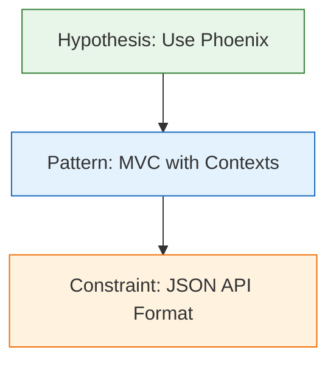

# CrucibleTrace Enhancement Design Document

**Date:** 2025-11-25
**Version:** 0.2.0
**Author:** Claude Code Agent
**Status:** Proposed

## Executive Summary

This document outlines proposed enhancements to the CrucibleTrace library to improve its capabilities for tracking, analyzing, and visualizing LLM decision-making processes. The enhancements focus on four key areas: chain comparison & diffing, event relationships, advanced querying, and Mermaid diagram export.

## Current State Assessment

### Strengths
- Solid foundation with 6 event types and comprehensive event tracking
- Well-structured codebase with clear separation of concerns (Event, Chain, Parser, Storage, Viewer)
- Good test coverage (103+ tests, ~1470 lines of test code)
- Interactive HTML visualization with filtering
- Multiple export formats (JSON, Markdown, CSV)
- Clean API with proper error handling

### Limitations Identified
1. **No chain comparison** - Cannot diff two chains to see what changed
2. **No event relationships** - Events are flat list, no parent/child or dependency modeling
3. **Limited search** - Only basic metadata filtering, no content search
4. **No Mermaid export** - Mentioned in roadmap but not implemented
5. **No cryptographic verification** - Mentioned in description but not implemented
6. **No confidence history** - Cannot track how confidence evolved over time
7. **No performance tracking** - No built-in support for token counts, latency, cost metrics

## Proposed Enhancements

### Phase 1: Core Improvements (v0.2.0)

#### 1. Chain Comparison & Diffing

**Rationale:** When debugging or improving LLM prompts, it's critical to understand how reasoning chains differ between runs. This enables prompt engineering, A/B testing, and regression detection.

**Features:**
- Compare two chains and identify:
  - Events present in one but not the other
  - Events with different decisions/reasoning
  - Confidence deltas
  - Event ordering differences
- Generate diff reports in text and HTML format
- Visual diff in HTML viewer with side-by-side comparison

**API Design:**
```elixir
# Compare two chains
{:ok, diff} = CrucibleTrace.diff_chains(chain1, chain2, opts \\ [])

# Diff struct
%CrucibleTrace.Diff{
  added_events: [event_ids],
  removed_events: [event_ids],
  modified_events: [{event_id, changes}],
  confidence_deltas: %{event_id => delta},
  similarity_score: 0.0..1.0,
  summary: "text summary"
}

# Generate diff report
{:ok, html} = CrucibleTrace.diff_to_html(diff, chain1, chain2)
{:ok, text} = CrucibleTrace.diff_to_text(diff)
```

**Implementation:**
- New module: `CrucibleTrace.Diff`
- Algorithm: Myers diff algorithm for event sequence comparison
- Similarity scoring: Levenshtein distance for text fields, weighted average for overall
- Tests: 15+ tests covering various diff scenarios

#### 2. Event Relationships & Dependencies

**Rationale:** LLM reasoning is hierarchical - decisions build on earlier decisions. Modeling these relationships enables better analysis and visualization of reasoning flow.

**Features:**
- Add optional `parent_id` field to events
- Add optional `depends_on` list to events
- Query events by relationship (children, dependencies, roots)
- Visualize event graph structure

**API Design:**
```elixir
# Create event with parent
event = CrucibleTrace.create_event(
  :pattern_applied,
  "Use Supervisor",
  "Based on earlier GenServer decision",
  parent_id: parent_event.id,
  depends_on: [event1.id, event2.id]
)

# Query relationships
{:ok, children} = CrucibleTrace.get_child_events(chain, event.id)
{:ok, parents} = CrucibleTrace.get_parent_events(chain, event.id)
{:ok, roots} = CrucibleTrace.get_root_events(chain)
{:ok, leaves} = CrucibleTrace.get_leaf_events(chain)

# Validate relationship integrity
{:ok, chain} = CrucibleTrace.validate_relationships(chain)
# Returns {:error, issues} if circular dependencies detected
```

**Implementation:**
- Extend `Event` struct with `parent_id: String.t() | nil` and `depends_on: [String.t()]`
- New functions in `Chain` module for relationship queries
- Validation for circular dependencies
- Tests: 12+ tests covering relationship operations

#### 3. Advanced Querying & Content Search

**Rationale:** Users need to find specific events across many chains based on content, not just metadata.

**Features:**
- Full-text search across event decisions and reasoning
- Query by multiple criteria with AND/OR logic
- Regular expression matching
- Performance-optimized for large chains

**API Design:**
```elixir
# Content search
{:ok, events} = CrucibleTrace.search_events(chain,
  content: "GenServer",
  type: [:hypothesis_formed, :pattern_applied],
  min_confidence: 0.8
)

# Advanced query with boolean logic
{:ok, events} = CrucibleTrace.query_events(chain, %{
  or: [
    %{content: ~r/GenServer/i, confidence: {:gte, 0.9}},
    %{type: :ambiguity_flagged}
  ]
})

# Search across multiple chains
{:ok, results} = CrucibleTrace.search_all_chains(
  storage_dir: "traces",
  content: "rate limiter",
  created_after: ~U[2025-01-01 00:00:00Z]
)
```

**Implementation:**
- New module: `CrucibleTrace.Query`
- Use Elixir's `Enum` functions with optimized filtering
- Support regex via Elixir's `Regex` module
- Tests: 18+ tests covering various query scenarios

#### 4. Mermaid Diagram Export

**Rationale:** Mermaid is widely supported in markdown renderers (GitHub, GitLab, Obsidian). It provides excellent visual documentation without external dependencies.

**Features:**
- Export chain as Mermaid flowchart
- Export chain as Mermaid sequence diagram
- Export chain as Mermaid timeline
- Color-code by event type
- Include confidence levels

**API Design:**
```elixir
# Export as flowchart
{:ok, mermaid} = CrucibleTrace.export_mermaid(chain, :flowchart)

# Export as sequence diagram
{:ok, mermaid} = CrucibleTrace.export_mermaid(chain, :sequence)

# Export as timeline
{:ok, mermaid} = CrucibleTrace.export_mermaid(chain, :timeline)

# Options
{:ok, mermaid} = CrucibleTrace.export_mermaid(chain, :flowchart,
  include_confidence: true,
  color_by_type: true,
  max_label_length: 50
)
```

**Example Output:**


**Implementation:**
- New module: `CrucibleTrace.Mermaid`
- Generate valid Mermaid syntax
- Escape special characters properly
- Tests: 15+ tests covering all diagram types

### Phase 2: Future Enhancements (v0.3.0+)

#### 5. Cryptographic Verification (Future)

**Rationale:** For auditing and compliance, chains need tamper-proof verification.

**Features:**
- SHA-256 hashing of each event
- Chain-of-custody linking (each event references previous hash)
- Digital signatures for authentication
- Verification API

**Deferred Rationale:** Requires careful security design and potentially external dependencies for crypto operations.

#### 6. Performance Metrics (Future)

**Features:**
- Track token counts per event
- Track latency per event
- Track API costs
- Aggregate performance statistics

**Deferred Rationale:** Requires integration with specific LLM APIs, making it more opinionated.

#### 7. Confidence History & Evolution (Future)

**Features:**
- Track confidence changes over time for same decision
- Visualize confidence evolution
- Alert on significant confidence drops

**Deferred Rationale:** Requires event versioning system, adds complexity.

## Implementation Plan

### Sprint 1: Chain Diffing (2-3 days)
1. Design diff algorithm
2. Implement `CrucibleTrace.Diff` module
3. Write comprehensive tests
4. Add HTML diff viewer
5. Update documentation

### Sprint 2: Event Relationships (2-3 days)
1. Extend Event struct with relationship fields
2. Implement relationship query functions
3. Add validation for circular dependencies
4. Write comprehensive tests
5. Update documentation and examples

### Sprint 3: Advanced Querying (2-3 days)
1. Design query DSL
2. Implement `CrucibleTrace.Query` module
3. Add content search capabilities
4. Write comprehensive tests
5. Update documentation

### Sprint 4: Mermaid Export (1-2 days)
1. Implement `CrucibleTrace.Mermaid` module
2. Support flowchart, sequence, timeline formats
3. Add styling and color-coding
4. Write comprehensive tests
5. Update documentation and examples

### Sprint 5: Integration & Polish (1-2 days)
1. Integration testing across all new features
2. Performance testing
3. Documentation review
4. Example scripts
5. Version bump and changelog

## Testing Strategy

### Test Coverage Goals
- Maintain >90% code coverage
- Zero compilation warnings
- All tests pass with `mix test --warnings-as-errors`
- Property-based testing for diff algorithms (using StreamData)

### Test Categories
1. **Unit Tests:** Each new function has dedicated tests
2. **Integration Tests:** Test features working together
3. **Property Tests:** Verify invariants (e.g., diff(A,B) + diff(B,A) = identity)
4. **Performance Tests:** Ensure reasonable performance on large chains (1000+ events)

## API Stability & Versioning

### Breaking Changes
- None expected - all enhancements are additive
- Event struct extended but old serialized events still loadable
- Backward compatible with v0.1.0 saved chains

### Version Bump: 0.1.0 → 0.2.0
- Minor version bump (new features, no breaking changes)
- Follows semantic versioning

## Documentation Updates

### README.md
- Add new features section
- Update quick start examples
- Add comparison example
- Add Mermaid export example

### CHANGELOG.md
- Add v0.2.0 section with date 2025-11-25
- List all new features
- Note backward compatibility

### Examples
- New file: `examples/chain_comparison.exs`
- New file: `examples/event_relationships.exs`
- New file: `examples/advanced_queries.exs`
- New file: `examples/mermaid_export.exs`

## Success Metrics

### Quantitative
- All 60+ new tests pass
- Test coverage remains >90%
- Zero warnings on compile
- Performance: Diff algorithm O(n*m) where n,m are chain sizes
- Documentation: 100% public API coverage

### Qualitative
- Clear, intuitive API
- Comprehensive examples
- Well-documented code
- Smooth upgrade path from v0.1.0

## Risks & Mitigation

### Risk 1: Performance with Large Chains
**Mitigation:** Implement streaming/lazy evaluation for search, benchmark with 10k+ event chains

### Risk 2: Diff Algorithm Complexity
**Mitigation:** Use well-tested Myers diff algorithm, extensive property-based testing

### Risk 3: Mermaid Syntax Edge Cases
**Mitigation:** Proper escaping, test with complex event content including special characters

### Risk 4: API Surface Growth
**Mitigation:** Keep Core API stable, new features in separate modules, good defaults

## Alternatives Considered

### Alternative 1: GraphQL API for Querying
**Rejected:** Too heavyweight for a library, adds external dependencies

### Alternative 2: Database Backend
**Rejected:** Premature, file-based storage sufficient for now, can add later

### Alternative 3: Visual Graph Editor
**Rejected:** Out of scope for v0.2.0, requires GUI framework

## Conclusion

This enhancement proposal significantly improves CrucibleTrace's analytical capabilities while maintaining backward compatibility and the library's focus on simplicity. The additions are well-scoped, testable, and provide immediate value to users debugging and improving LLM reasoning chains.

## Appendix: API Reference

### New Modules
- `CrucibleTrace.Diff` - Chain comparison and diffing
- `CrucibleTrace.Query` - Advanced querying and search
- `CrucibleTrace.Mermaid` - Mermaid diagram generation

### Extended Modules
- `CrucibleTrace.Event` - Add relationship fields
- `CrucibleTrace.Chain` - Add relationship query functions
- `CrucibleTrace.Storage` - Extend export to include Mermaid

### New Functions Count
- Diff module: 8 functions
- Query module: 6 functions
- Mermaid module: 5 functions
- Chain extensions: 6 functions
- Total: 25 new public functions

### Estimated LOC
- Implementation: ~800 lines
- Tests: ~600 lines
- Documentation: ~400 lines
- Total: ~1800 lines
